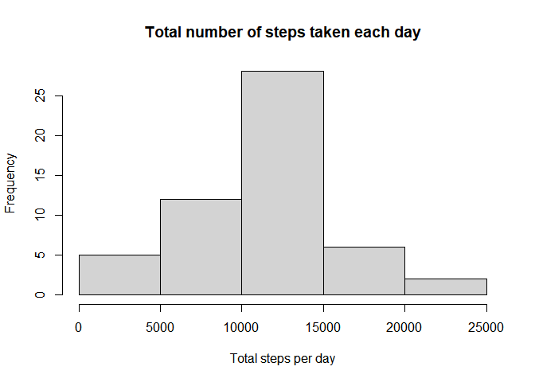
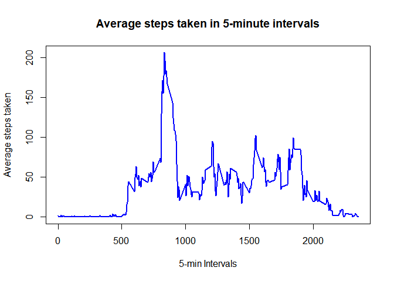
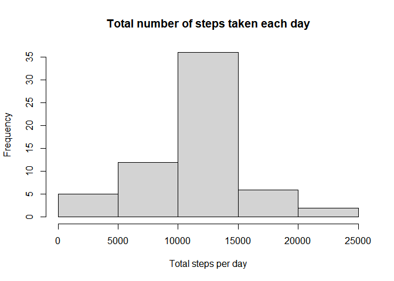
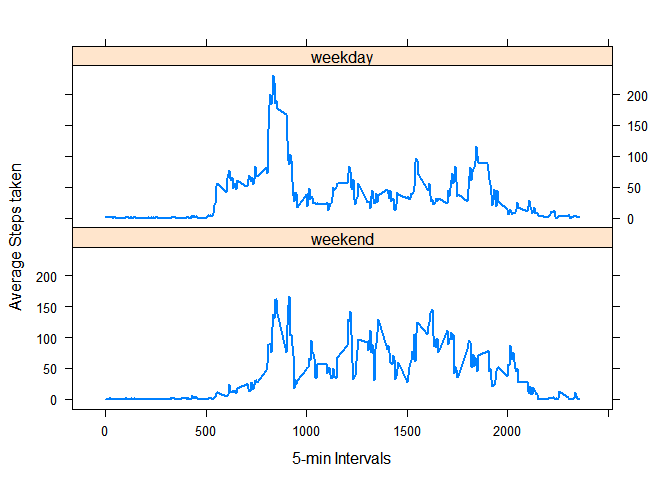

## Library Used


```r
library(lattice)
library(dplyr)
```

```
## 
## Attaching package: 'dplyr'
```

```
## The following objects are masked from 'package:stats':
## 
##     filter, lag
```

```
## The following objects are masked from 'package:base':
## 
##     intersect, setdiff, setequal, union
```

```r
library(lubridate)
```

```
## 
## Attaching package: 'lubridate'
```

```
## The following objects are masked from 'package:dplyr':
## 
##     intersect, setdiff, union
```

```
## The following objects are masked from 'package:base':
## 
##     date, intersect, setdiff, union
```

## Loading and preprocessing the data


```r
unzip("activity.zip")
activity <- read.csv("activity.csv")
act_na <- na.omit(activity)
```


## What is mean total number of steps taken per day?

First group the data by date to calculate the number of steps taken per day and plot its histogram

```r
act_day <- group_by(act_na,date) %>%
           summarise(steps=sum(steps)) %>%
           select(date,steps)
hist(act_day$steps,xlab = "Total steps per day", main = "Total number of steps taken each day")
```

<!-- -->

The mean and the median are calculated as follows

```r
act_day_mean <- mean(act_day$steps)
act_day_mean
```

```
## [1] 10766.19
```

```r
act_day_median <- median(act_day$steps)
act_day_median
```

```
## [1] 10765
```


## What is the average daily activity pattern?

For the Timeseries plot first group the data by intervals and then summarise for average steps taken

```r
act_time <- group_by(act_na,interval) %>%
            summarise(steps=mean(steps)) %>%
            select(interval,steps)
plot(act_time,type="l",col="blue",lwd=2,xlab = "5-min Intervals",ylab = "Average steps taken",
     main = "Average steps taken in 5-minute intervals")
```

<!-- -->

5-min interval of maximum average steps 

```r
max_steps <- act_time[act_time$steps== max(act_time$steps),]$interval
max_steps
```

```
## [1] 835
```


## Imputing missing values

No. of rows with missing dataa

```r
na_count <- nrow(activity[is.na(activity$steps),])
na_count
```

```
## [1] 2304
```

Filling of missing data using mean of steps and rounding them off

```r
act_im <- activity %>%
          group_by(interval) %>%
          mutate(daily_mean = mean(steps,na.rm = TRUE))

# Rounding off the mean as number of steps will be positive integers
act_im$steps <- ifelse(is.na(act_im$steps),round(act_im$daily_mean),act_im$steps)
```

Histogram for total steps per day after imputing data

```r
act_im_day <- group_by(act_im,date) %>%
              summarise(steps=sum(steps)) %>%
              select(date,steps)

hist(act_im_day$steps,xlab = "Total steps per day", main = "Total number of steps taken each day")
```

<!-- -->

Mean of steps taken

```r
act_im_day_mean <- mean(act_im_day$steps)
act_im_day_mean
```

```
## [1] 10765.64
```

Median of steps taken

```r
act_im_day_median <- median(act_im_day$steps)
act_im_day_median
```

```
## [1] 10762
```

There is a very small variation in the mean and median of the steps taken but the total number of steps taken has been increased as would be expected


## Are there differences in activity patterns between weekdays and weekends?

First we have to split the data into weekdays and weekends for which we convert the dates into days and then create a new column to divide them into "weekdays" and "weekends".

```r
act_week <- act_im
act_week$date <- weekdays(as.Date(act_im$date))
weekday <- c('Monday', 'Tuesday', 'Wednesday', 'Thursday', 'Friday')
act_week$day <- factor(ifelse(act_week$date %in% weekday,"weekday","weekend"))
```

Now, calculate the mean steps after grouping by 5 min intervals and type of day and plot them on different panels

```r
act_week<-act_week %>% group_by(interval,day) %>% summarise(steps=mean(steps))
xyplot(steps~interval | day,data=act_week,layout= c(1,2),index.cond=list(c(2,1)),type="l",lwd=2,
       ylab="Average Steps taken",xlab= "5-min Intervals")
```

<!-- -->

